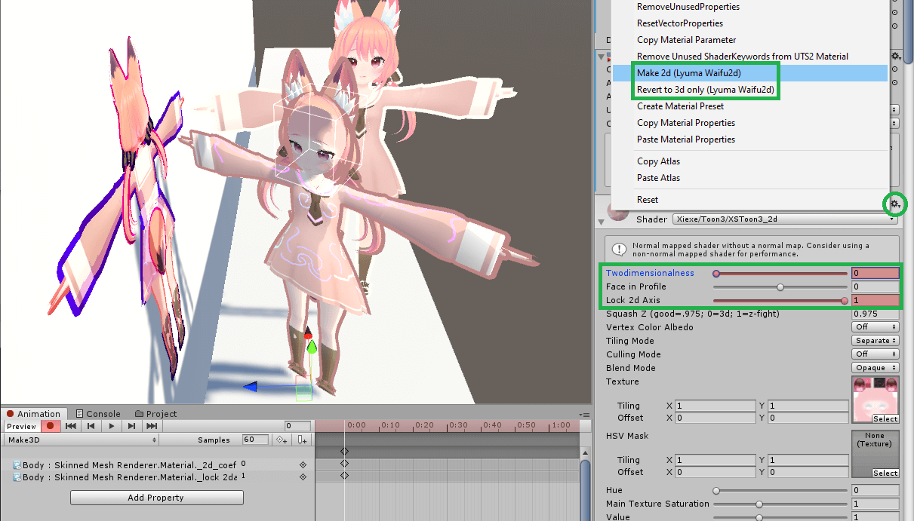

# Lyuma's Shaders

This is a collection of editor scripts and shaders for Unity or VRChat. Currently, the repository focuses on a 2d effect. More shaders and scripts will be coming.

To download, expand the Releases link, and download the unitypackage... Or, click the green Code button and Download ZIP. Then extract into your unity Assets folder.

# Waifu2d

This feature, "Make 2d", will flatten any material onto a vertical plane, by modifying the shader.

\
*Featured: Amanatsu by komado showing Silent's Crosstone, Xiexe's XSToon 3.0.1 and Poiyomi Toon v7.1.53*

To access, select all the materials you wish to convert, then use the gear menu to select **Make 2d** - to switch materials back to 3d mode, select **Revert to 3d**. It works well when combined with an extremely thick outline with solid color.

## How to configure and animate 2d effects

The material inspector is disabled once you are in 2d mode. While in this mode, you can configure the plane to face one direction (Locked to a 2d axis determined by Facing direction), or billboarded to the player's camera for a sprite game feel. Feel free to revert to 3d to make more material changes, or edit the sliders directly.

You can animate the _2d_coef and _lock_2d_axis material values for switching between 2d, billboard, and 3d modes. You must do this on every mesh to avoid clipping. You may want to also animate the outline width to be smaller when in 3d.

Note that this shader cheats and produces falsified depth values to minimize Z-fighting. However, if you wish to mix parts in 2d and 3d, you can adjust the "Squash Z" value to some value usually around 0.95 or 0.975 so that they line up.

## Other notes about 2d

This shader requires that *all* meshes have the same **Root Bone** slot set in the SkinnedMeshRenderer. Changing the Root Bone is mostly safe, but you must adjust the Mesh Bounds to compensate. If you have any meshes which are not skinned, they will not align to the same 2d plane and may look unusual. This is best fixed from within blender by combining meshes.

"See self in 3d" has been removed. If you need this functionality use the Avatar 3.0 IsLocal parameter.

Note that this includes a copy of the built-in Standard shader for metallic setup only. Specular setup is not implemented yet, but would be easy to add if requested.

# LyumaMeshTools (LMT)

The LyumaMeshTools editor script is located in LyumaShader/Editor. It contains a set of features in the gear or right click menu of Mesh Renderer and similar components. If you want to customize these, pick the closest one and edit the source code.

- "**Vertex position to UV2 : LMT**" : records original vertex position for use with shading effects that deform properly with skinned meshes (similar to using Project From View in blender, but with all 3 axes)

- "**Merge UV with UV2 : LMT**" puts UV2.xy as the .zw components of UV. Can be used similarly as vertex colors. This frees up the second UV for baked lightmaps.

- "**Assetize Meshes : LMT**" properly duplicates the mesh out of an FBX file.

- "**Add Shadow : LMT**" adds another material sharing vertices but with a face for every face in existing materials. Can be used for a stencil or with my shadow shader to make a shadow around your mesh.

- "**Combine Same Material : LMT**" is an optimization tool to combine all copies of the same material into one. You can control this process by manually putting the same material into different slots before running this script.

- "**Remove Null Mats : LMT**" removes any material in a mesh and the corresponding polygons for any unassigned (pink) material slots. NOTE: Does not remove unused vertices.

- "**Combine Mesh Siblings : LMT**" Is an optimization tool to combine all skinned mesh renderers with the same parent into one skinned mesh renderer with multiple materials. It can also be useful to guarantee meshes are rendered in order.\
\
"Combine Mesh Siblings" now also merges blendshapes from sibling meshes. This way, you can pick any mesh to be the main Body mesh and not worry about losing blendshapes.

- "**Make Skinned Parent+Child : LMT**" Builds skinned meshes out of non-skinned: See this tutorial:\

- "**Keyframe Blend Shapes : LMT**" is a unique feature that edits a mesh with blendshapes named with a percent at the end like Blink_25% Blink_50% and merges them into a single blendshape at those percents. This tool can create instant blend shapes as well as any sort of custom mesh animation from a single gesture (or activation of multiple props from variable fist pressure). There is no way to my knowledge to import such blend shapes.\
\
Most of these things could be done in blender. Add Shadow is one of the more interesting tools: it is very efficient compared to duplicating vertices, duplicating meshes or even adding passes into multiple different shaders, and it allows you to make effectively a shader pass on a different queue. It's not trivial to do this in blender.\
\
Blend shape keyframing is probably by far the most interesting. The way to use it is you must import blendshapes named like this with _ or space and a percent.\
\
The following will generate a single blendshape called coolface that hits those keyframes on the way from 0 to 100. If you weight paint a prop to your main avatar mesh, this can allow for animations upon activating the prop from a gesture, without needing a whole animator setup
> - coolface 10%
> - coolface 30%
> - coolface_50%
> - coolface_100%

You may need to run multiple tools depending on how your mesh is laid out, but Combine Mesh Siblings will get you most of the way. Make sure to disable the other meshes or delete them afterwards (will require Unpack Prefab). Also, Combine Same Material will help once you have merged meshes.

# Other Contents

* LyumaShader/DropShadowLite.shader: This renders a flat drop shadow behind the object. Usually used by making a duplicate of your material or mesh and applying this shader to the duplicate. It contains its own offset, so it is ok to apply to a SkinnedMeshRenderer of an existing armature.

# Conclusion

That's it for now. In the future, I may include screenshots, samples, etc.

I also have a collection of GPU skinning examples in the `newshaderskin` branch.

Also, check out my gists: https://gist.github.com/lyuma

# Contact

Feel free to contact me by opening an issue, Lyuma on Discord (#0781), or by email at xnlyuma@gmail.com
